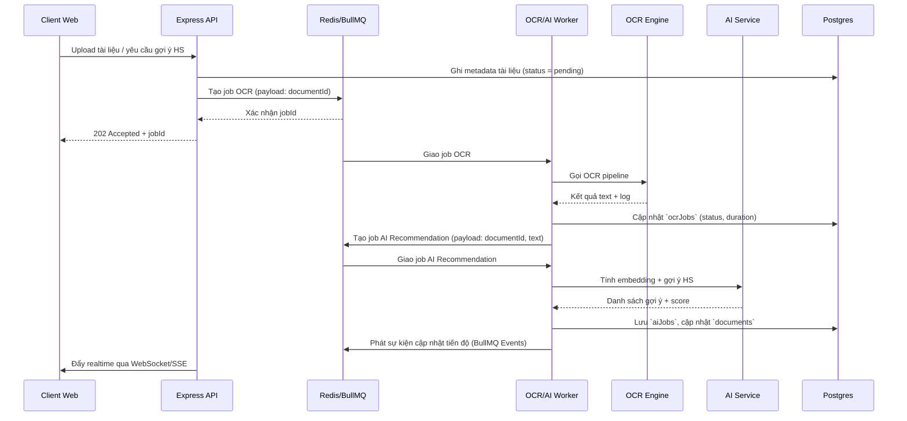
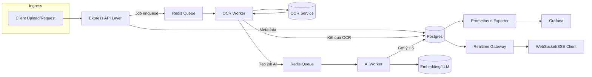

# Thiết kế kiến trúc hàng đợi OCR/AI

Tài liệu này mô tả cách triển khai lớp hàng đợi bất đồng bộ cho các tác vụ OCR và AI gợi ý mã HS trong hệ thống Customs Scraper. Thiết kế ưu tiên khả năng mở rộng, độ tin cậy và tính quan sát, đồng thời tận dụng các thành phần hiện có trong thư mục `server/`.

## Tổng quan thành phần

| Thành phần | Vai trò chính | Ghi chú triển khai |
| --- | --- | --- |
| **Express API (server/routers.ts)** | Nhận yêu cầu tải tài liệu, gợi ý HS, cập nhật trạng thái | Bổ sung middleware chuyển tác vụ tốn thời gian vào hàng đợi thay vì xử lý trực tiếp |
| **Redis + BullMQ** | Hàng đợi phân tán quản lý job `scrape`, `ocr`, `aiRecommendation` | Redis Cluster (2 shard + 1 replica) hoặc Redis Enterprise Cloud. Sử dụng BullMQ Queue + QueueScheduler + Worker |
| **Workers (server/scripts/jobs/...)** | Xử lý job OCR/AI theo hàng đợi, giao tiếp với dịch vụ OCR/AI bên ngoài | Mỗi worker là tiến trình Node.js riêng, scale theo số core. Dùng `BullMQ Worker` với concurrency cấu hình |
| **OCR Service (server/ocr-processor.ts)** | Gọi pipeline OCR (Tesseract/Azure/Google Vision) | Chuyển sang gọi async, retry qua BullMQ, ghi log chi tiết |
| **AI Suggestion Service (server/product-keyword-service.ts, future module)** | Tính embedding, gợi ý HS code | Thực thi trong worker, cache embedding trong Redis + Postgres vector |
| **Postgres/Drizzle** | Lưu trạng thái job, tài liệu, kết quả | Thêm bảng `scrapeJobs`, `ocrJobs`, `aiJobs`, `document_embeddings` |
| **Prometheus Exporter** | Thu thập metric job | Expose endpoint `/metrics` từ worker & API |
| **Grafana Dashboard** | Quan sát | Dashboard realtime số job thành công, thời gian trung bình, tỉ lệ lỗi |

## Luồng dữ liệu chính

## Sơ đồ lưu đồ dữ liệu

## Chi tiết các bảng mới

- `scrapeJobs`
  - `id`, `documentId`, `type` (`scrape|ocr|ai`), `payload`, `status`, `retryCount`, `errorMessage`, `startedAt`, `completedAt`.
- `ocrJobs`
  - `id`, `documentId`, `engine`, `durationMs`, `confidence`, `status`, `logs`.
- `aiJobs`
  - `id`, `documentId`, `model`, `suggestions`, `confidence`, `status`, `createdAt`.
- `document_embeddings`
  - `documentId`, `embedding_vector`, `model`, `version`, `updatedAt`.

## Quy ước triển khai

1. **Queue naming**: `queue:ocr`, `queue:ai`, `queue:scrape`. Channel sự kiện progress: `events:job-status`.
2. **Retry & Backoff**: OCR tối đa 3 lần (delay tăng dần 30s, 2m, 5m). AI tối đa 2 lần.
3. **Timeout**: OCR job 6 phút, AI job 2 phút.
4. **Observability**: log theo cấu trúc JSON (`pino`). Metric Prometheus: `queue_job_duration_seconds`, `queue_job_failures_total`, `queue_job_active`.
5. **Bảo mật**: Redis bảo vệ TLS, worker đọc secret từ Vault/ENV. Payload job chỉ chứa ID thay vì toàn dữ liệu để giảm rủi ro.

## Checklist triển khai

- [ ] Cấu hình Redis & BullMQ trong `server/_core/queue.ts`.
- [ ] Tạo worker riêng cho OCR (`server/scripts/workers/ocr-worker.ts`).
- [ ] Refactor router upload (`server/scraper-router.ts`) để enqueue job.
- [ ] Bổ sung migration bảng job trong thư mục `drizzle/`.
- [ ] Xuất metric Prometheus từ worker (`/metrics`).
- [ ] Viết test integration (Vitest + Testcontainers) mô phỏng Redis.

